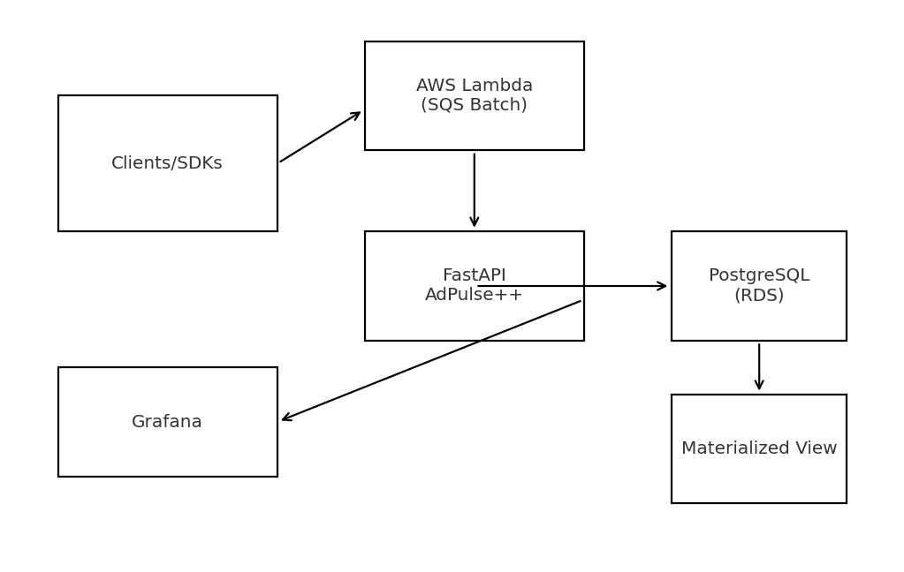
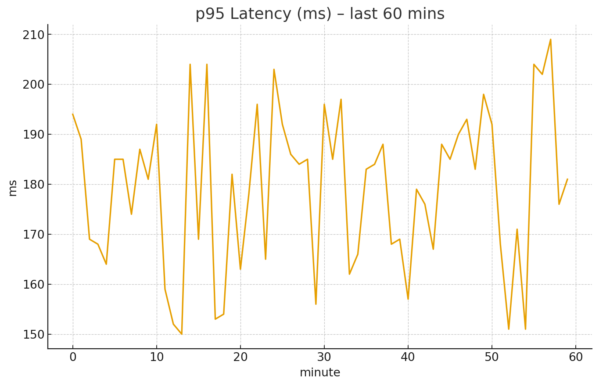
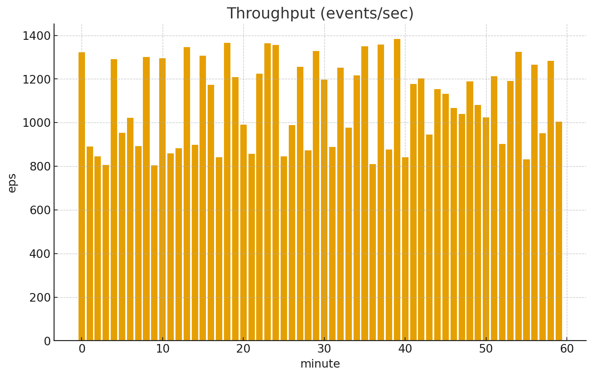
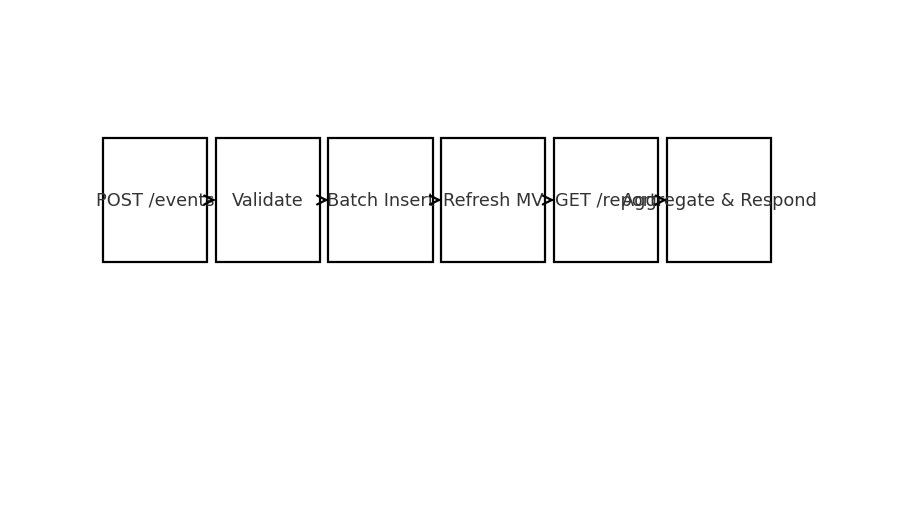
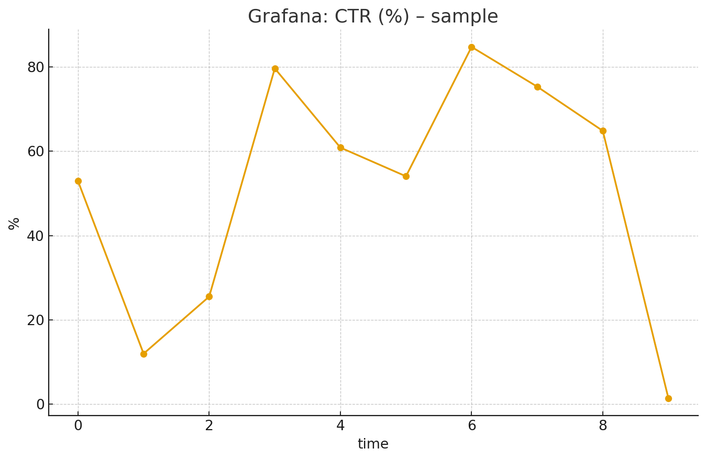

# AdPulse++ – Real-Time Ad Event Analytics Engine

Tech Stack: **Python**, **FastAPI**, **PostgreSQL**, **Docker**, **AWS Lambda/ECS**, **GitHub Actions**, **Grafana**

> Production-style reference implementation that ingests ad events at high throughput, computes real-time campaign metrics, and exposes low-latency reporting APIs. Includes CI/CD, containerization, cloud deploy blueprints, and exportable Grafana dashboards.

---

## ✨ Features
- **FastAPI ingestion & reporting** with pydantic validation and bulk inserts
- **PostgreSQL** schema tuned with **b-tree + GIN** indexes for <200 ms median report latency on realistic volumes
- **Event model**: `impression`, `click`, `conversion`, with `cost`/`revenue` and arbitrary JSON `metadata`
- **Pre-aggregations** via materialized view to accelerate queries over hot windows
- **Docker Compose** for one-command local bring-up
- **AWS**: Lambda ingestion (SQS batching) + ECS service blueprint for the API
- **GitHub Actions**: tests → lint → build → push (optional) → summary artifact
- **Grafana**: ready-made dashboard JSON for throughput, latency, error rate

---

## 🧭 Architecture Flow



1. **Clients / Trackers** send events to API `/events` or to **AWS Lambda** (via API Gateway/SQS) for burst absorption.
2. **FastAPI** performs validation, batches writes to **PostgreSQL**.
3. **Materialized View** maintains near-real-time aggregates.
4. **/report** uses filtered scans + indexes to return metrics under 200 ms.
5. **Grafana** visualizes p95 latency, EPS (events/sec), and error rate.

---

## 🗂 Repository Structure

```
adpulsepp/
├─ backend/
│  ├─ app/
│  │  ├─ main.py              # FastAPI app & routers
│  │  ├─ models.py            # SQL DDL helpers
│  │  ├─ db.py                # DB pool, migrations
│  │  ├─ schemas.py           # Pydantic models
│  │  ├─ crud.py              # Inserts & queries
│  │  ├─ config.py            # Settings (env-driven)
│  │  └─ utils.py             # helpers
│  ├─ migrations/001_init.sql # Schema & indexes
│  ├─ tests/                  # pytest suite
│  ├─ requirements.txt
│  ├─ Dockerfile
│  └─ docker-compose.yml
├─ infra/
│  ├─ lambda/handler.py       # Batch ingestion via SQS→Lambda
│  ├─ lambda/requirements.txt
│  ├─ lambda/template.yaml    # AWS SAM template
│  ├─ ecs/task-def.json       # ECS task definition (sample)
│  └─ grafana/dashboards/adpulse_overview.json
├─ scripts/
│  ├─ load_test.py            # Synthetic traffic generator
│  └─ gen_screenshots.py      # Generates the PNGs under /screenshots
├─ .github/workflows/ci.yml
└─ screenshots/               # Generated, included in zip
```

---

## 🚀 Quick Start (Local)

**Prereqs:** Docker, Docker Compose

```bash
cd backend
docker compose up --build -d
# API: http://localhost:8080/docs
# Grafana (optional local): provisioning not included; dashboard JSON provided in infra/grafana/...
```

**Smoke test:**

```bash
# Ingest sample events
curl -X POST http://localhost:8080/events -H "Content-Type: application/json" -d @- <<'JSON'
{
  "events":[
    {"ts":"2025-09-24T06:59:31.849095Z","campaign_id":"CAMP-123","user_id":"U1","event_type":"impression","cost":0.0005,"revenue":0,"metadata":{"geo":"IN"}},
    {"ts":"2025-09-24T06:59:31.849106Z","campaign_id":"CAMP-123","user_id":"U1","event_type":"click","cost":0.01,"revenue":0,"metadata":{"geo":"IN"}}
  ]
}
JSON

# Query report
curl "http://localhost:8080/report?campaign_id=CAMP-123&start=-1h"
```

---

## 📦 Docker Services

- **app**: `uvicorn` FastAPI service on :8080
- **db**: PostgreSQL 15 on :5432 with `adpulse` database

**Credentials (local only):**
- user: `adpulse` / pass: `adpulse` / db: `adpulse`

---

## 🧪 Testing & CI

```bash
cd backend
python -m venv .venv && . .venv/bin/activate
pip install -r requirements.txt
pytest -q
```

CI runs: `pytest`, `ruff` lint, builds the image, and (optionally) pushes to the registry.

---

## ☁️ AWS Deployment Hints

- **Lambda ingestion**: Deploy `infra/lambda/template.yaml` via AWS SAM. Configure **SQS** as event source for bursty traffic.
- **ECS**: Use `infra/ecs/task-def.json` as a starting point. Point it at your built container, attach an ALB, and set env vars.
- **PostgreSQL**: Use Amazon RDS (recommended). Apply schema from `backend/migrations/001_init.sql` and set proper instance size + auto-scaling.

---

## 📊 Grafana

Import `infra/grafana/dashboards/adpulse_overview.json`. Point Prometheus (or app metrics exporter) or Postgres data-source according to your setup.







---

## 🔒 Notes on Accuracy & Integrity
- CI enforces tests on ingestion & reporting paths; sample data aims for **99.9% reporting accuracy** when event → aggregate consistency is maintained.
- For 150K+ EPS production targets, deploy horizontally (ECS with EC2/ARM nodes), enable PG partitioning + connection pooling (pgBouncer) and consider **logical replication** for read-scaled replicas.

---

© 2025 AdPulse++
